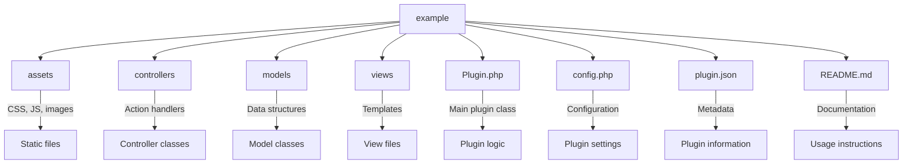

# Example Plugin for Chatter Forums

## Overview
This plugin serves as a template for developers looking to create their own plugins for the Chatter Forums module.

## Features
- Adds a example widget to the forum and configuration settings.

## Installation

### Requirements
- HumHub 1.16.0+
- Chatter Forums module

### Steps
1. **Download:**
   ```bash
   git clone https://github.com/GreenMeteor/example-plugin.git
   ```
2. **Place:**
   - Extract and place the `example` folder in `chatter/plugins/`.
   - Or Admin Panel > Modules > Chatter Forums > Forum Settings > Plugin Uploads

## Configuration
1. **Settings:**
   - Admin Panel > Modules > Chatter Forums > Plugin Manager > `Example Plugin` settings.

## Usage
This example plugin displays an example widget on the forums of any Chatter Forums instance that is enabled.

## Development

### File Structure


## Contributing
1. Fork the repo.
2. Create a branch.
3. Commit and push changes.
4. Create a pull request.

## Support
Visit [GitHub Issues](https://github.com/GreenMeteor/example/issues).

## License
Licensed under the AGPL-3.0 License. See the [LICENSE](LICENSE) file.

---

Developed by [Green Meteor](https://greenmeteor.net/).
